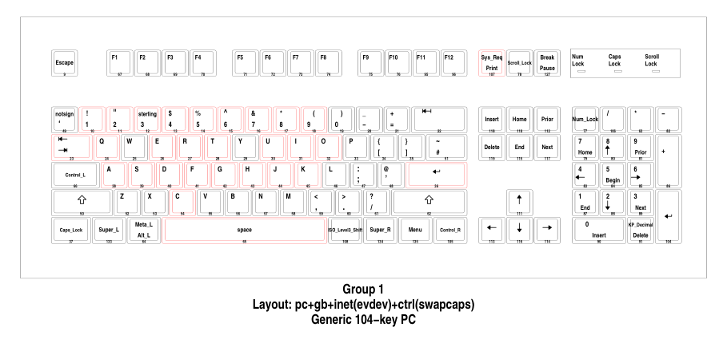

# Xmonad shourtcut keymap visualizer

View what keys your xmonad currently uses.



## How to use:
- Copy the `script.sh` file, place it wherever you want, put it on $PATH if you prefer.
- Copy the `Keymap.sh` file, add it under the lib folder of your xmonad config or paste it in your `xmonad.hs` file
- Add a shortcut to view the keymap:

```haskell
myKeys conf@XConfig {XMonad.modMask = modm} = M.fromList $
    [ (...)
    , ((modm .|. shiftMask, xK_e), Keymap.viewKeymap (myKeys conf) "/home/yogurt/code/xmonadkeymap/script.sh")
    ]
```

## How it works
This is done through a script file and some haskell code. The idea is that the script file can be used for implementing this functionality in any other WM, as long as it provides a list of key codes that it uses

xkbprint is able to produce a drawing of your keyboard, what's needed is that it colours specific keys.

First, the haskell function collects all keycodes that you use and sends it to the script.

Then, the script looksup through xkbcomp what these keycodes correlate to, in terms of xkb symbols, for example:
`<AE01> = keycode 10` (key for "1").

After we have those values, xkbprint is ran which generates Postscript, we go through each line of PostScript and when we find the command that draws rectangles for keys, set the color to red and reset it after.

# Script dependencies
- xkbcomp
- ghostscript (for ps2pdf)
- xkbprint
- awk
- zathura (for viewing pdfs through a UNIX pipe)

## TODO: (PR's welcome)
- Publish to xmonad-contrib
- make it work for xf86 keys (play, pause, etc)
- view keys used inside submaps (XMonad.Actions.Submap)
- configurable colors to display based on modifier keys